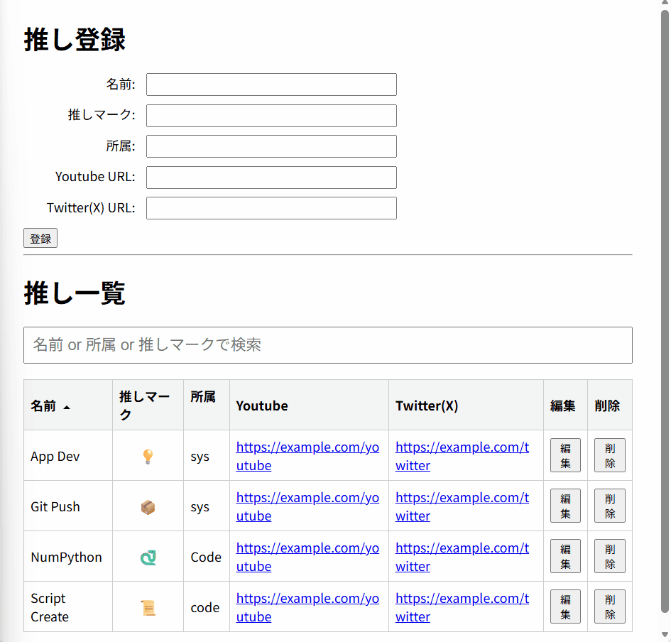

# Oshi-DB: A Full-Stack Talent-Data App (推しDB)

## 🚀 キャプチャ / デモ



## 概要

Python(Flask)とJavaScriptで構築された、シンプルな「推し」管理データベースです。  
SPA（シングルページアプリケーション）風のUIを採用し、Fetch APIを用いた非同期通信により、ページの再読み込みなしで「タレントの登録・更新・削除・検索」が可能です。  
Web開発のフルスタックな基礎（バックエンドAPI、データベース、フロントエンドDOM操作）を実践するために作成しました。

## 🛠️ 使用技術

* **Backend:** Python 3.x, Flask, Flask-SQLAlchemy
* **Database:** SQLite
* **Frontend:** HTML5, CSS3, Vanilla JavaScript (ES6+)
* **Key APIs:** Fetch API, DOM Manipulation

## ✨ 機能一覧

* **タレント管理 (非同期CRUD)**
    * 登録: 新しいタレントをDBに追加します (非同期)
    * 一覧: 登録済みタレントをテーブル表示します
    * 更新: 既存のタレント情報を編集します (非同期)
    * 削除: タレントをDBから削除します (非同期)
* **リアルタイム検索**
    * 検索ボックスに入力すると、即座に「名前」「所属」「推しマーク」で部分一致検索が実行されます。
* **クライアントサイド・ソート**
    * テーブルのヘッダー（名前、推しマーク、所属）をクリックすると、表示中のデータを並べ替えることができます。

## 📦 インストール / セットアップ

1.  リポジトリをクローンします
    ```bash
    git clone https://github.com/Dai-j23/Oshi-DB.git
    cd Oshi-DB
    ```
2.  Pythonの仮想環境を作成・有効化します
    ```bash
    # Windows
    python -m venv venv
    .\venv\Scripts\activate
    # Mac / Linux
    python3 -m venv venv
    source venv/bin/activate
    ```
3.  必要なライブラリをインストールします
    ```bash
    pip install -r requirements.txt
    ```
4.  Flask サーバーを起動します
    ```bash
    python app.py
    ```
5.  ブラウザで `http://127.0.0.1:5000` にアクセスします

## 📜 ライセンス

This project is licensed under the MIT License.

## 💡 工夫した点 / 苦労した点

### 1. CRUDを意識したフルスタック設計
このアプリケーションの核は、**CRUD** (Create, Read, Update, Delete) というWeb開発の基本原則です。
* **バックエンド (API設計):**
    Flaskのルーティングを使い、各操作 (`/add`, `/delete`, `/update`) に明確な責務を持たせました。特に削除処理では `DELETE` メソッドを採用し、適切なAPI設計を意識しました。
* **フロントエンド (UI/UX):**
    `fetch` API を使い、これらCRUD操作をすべて**非同期**で実行しています。ユーザーはページ遷移のストレスなく、データの「登録」「更新」「削除」が可能です。
* **データ連携:**
    フロントエンドとバックエンドの連携は、すべて **JSON形式** のデータを介して行われます。これにより、フロントとバックエンドを疎結合に保ち、将来的な拡張性（例えば、React/Vueへの載せ替え）も考慮した設計になっています。
### 2. Vanilla JSによるSPA風UIの実装
ReactやVue.jsのようなフレームワークに頼らず、あえて素のJavaScript (Vanilla JS)と`Fetch API` を使うことで、JavaScriptのコアな能力（DOM操作、非同期通信、イベントハンドリング）を深く理解することに挑戦しました。
* **非同期処理:** フォームの送信や削除ボタンのクリック時に、ページ全体をリロードするのではなく、`fetch` でバックエンドAPIと通信し、返ってきたJSONを元に `createTalentRowHTML` 関数でDOM（テーブルの行）を動的に書き換えています。
* **フォームのステート管理:** 新規登録フォームと編集フォームを共通化し、JavaScript側で「編集モード」の内部状態を持つことで、UI（ボタンのテキストなど）を切り替えるロジックを実装しました。
### 3. READMEジェネレータの活用
このREADME.mdファイル自体も、自作した **Haskell製 `README_Generator`** を使って生成しています。異なる言語（Haskell）で作成したツールを、別のプロジェクトで活用するという、実践的な試みを行いました。
